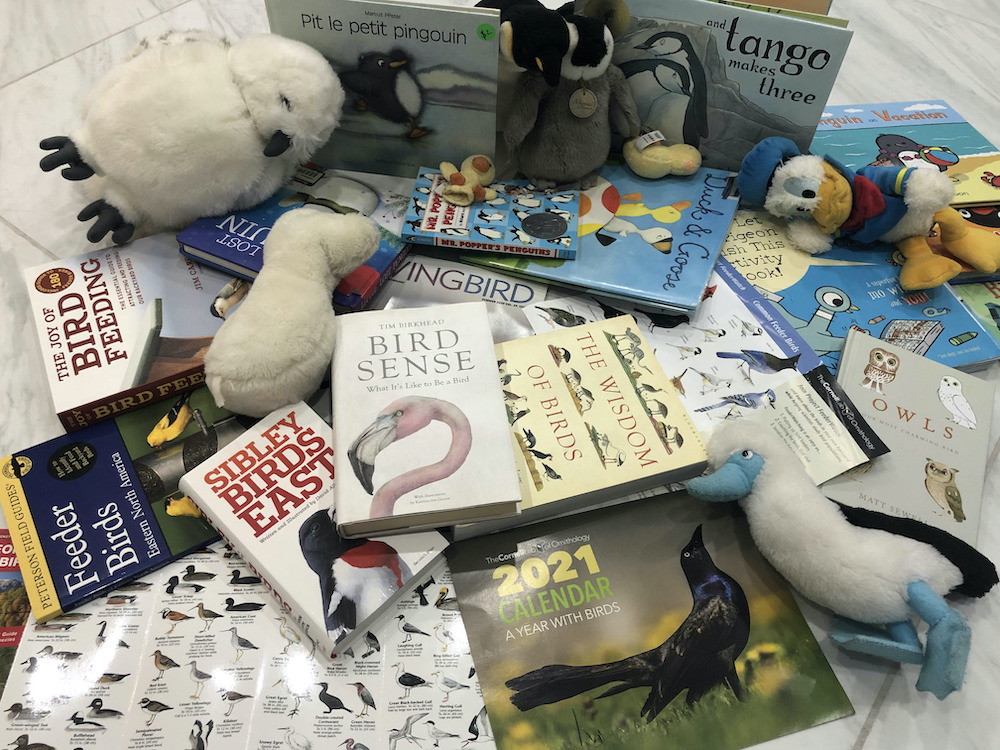

# **Happy Bird**: All About Birds

## Introduction

Happy Bird is an app where you can browse, search and favorite almost every bird in eBird's API and see certain information about them such as
- Common name
- Scientific name
- Order
- Family
- A certain amount of images if available

and in future

- Region
- Location on a map

It is built using Swift and used eBird and Flickr APIs and user location to show bird sightings nearby on a map.
***
## Relation to CS50

Happy Bird was built as the Final Project for CS50 to reflect all that has been learned through out the previous problem sets like dealing with memory, arrays, algorithms and data structures. A lot of the python syntax was used in swift, and the iOS track really helped with the making of the app. In future this app will help scientists keep track of bird population by submiting checklists to FeederWatch.
***
## Challenges

The biggest challenge overall was getting the project done by New Year's Eve. Since I started the project with 12 days to complete, it was very rushed and a lot of the features had to be modified so that it could be built from scratch in 12 days.

### Using APIs

One of the main challenges faced was getting the data from the APIs especially since I had to ask for the API key when I barely knew what the app would actually be like. Every API has a different structure and it is hard to get exactly the information that you want, especially because some of them require `http` headers, while others need the key in the url, and also filtering Flickr results was tough.

### Caching Data

Once I had the data, it was important to store it to prevent requesting the data too much and to also store it offline. This turned out to be quite difficult mainly because there wasn't enough online help in one method, and most of the caching methods were not up to date since Swift is not much of a common language.

### Other

Other challenges include storyboard constraints, since those can become very confusing and also the preview doesn't always exactly match the output. Also it was dificult to get the scroll view to work where you see the details, and since I only had limited time before the end of the year, I ended up changing the font size so that the user wouldn't need to scroll.
***
## Future Improvenents

Future improvements for Happy Bird include Bird news, Bird feeder/squirrel watching and showing where each bird is mainly found with regions.

### News

It is important to know what is happening right now about birds, so that is why happy bird will in future contain news about birds in a dedicated tab, from certain news sources.

### Squirrel Watching

Part of the original idea, was to have a place where people can post videos of squirrels defeating their squirrel protection systems or explaining how squirrels can't defeat them. People will also be able to comment on, and report a post, and upvote it if their solution worked, or if they like the way the squirrels defeated the feeder.

### Regions + Interactive map

Using eBird's API, I would be able to see where bird species mainly spend their time and put that in the details page, and also have a tab where users can see an interactive world map with regions on them, and once they tap the region it would show them all birds in that region in a list, and also have the subregions in that specific region where users will be able to zoom in on. Once a bird is tapped, it will show the locations for all the recent sightings of that bird in the specific region/subregion.

***
## Conclusion

Finally, I would like to thank CS50, for allowing me to make this app, my dad, for supporting and helping me the entire way, and eBird and Flickr for giving me the data needed to create the app.
***
## References

- “EBird API 2.0.” *EBird API 2.0*, 2020, [documenter.getpostman.com/view/664302/S1ENwy59?version=latest.](https://documenter.getpostman.com/view/664302/S1ENwy59?version=latest)
- “EBird - Discover a New World of Birding...” *eBird*, 2020, [ebird.org](ebird.org).
- “Project FeederWatch.” *FeederWatch*, 2020, [feederwatch.org/](feederwatch.org/).
- “Flickr Services.” *Flickr*, Flickr Services, 2013, [www.flickr.com/services/api/](www.flickr.com/services/api/).
- Birkhead, Tim. *Bird Sense: What It’s like to Be a Bird*. 2012. London, Bloomsbury, 2013.
- Birdshare. “Birdshare.” *Flickr*, Flickr, 31 Dec. 2020, [www.flickr.com/groups/birdshare](www.flickr.com/groups/birdshare).
- Malan, David, and Brian Yu. “CS50: Introduction to computer science.” CS50x. Harvard University. 2019.
- McWilliam, Tommy. “Week 8, iOS Track” CS50x. Harvard University. 2020.

Inspiration:

[Youtube Link](https://youtu.be/ZihulSBTP-s)
[Github Rep](https://github.com/goatoush/HappyBird)
